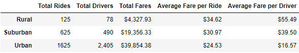
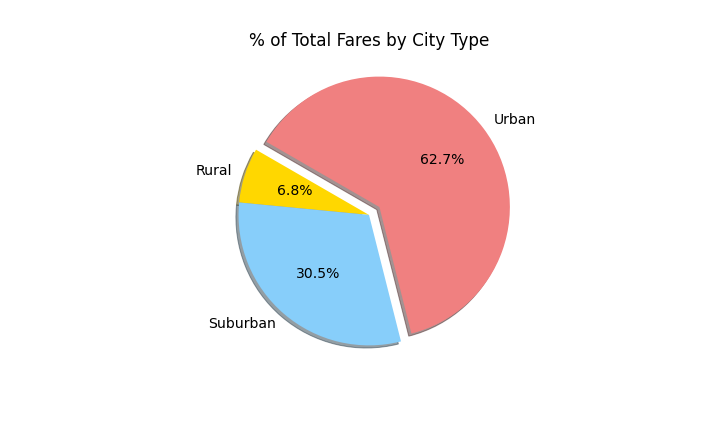
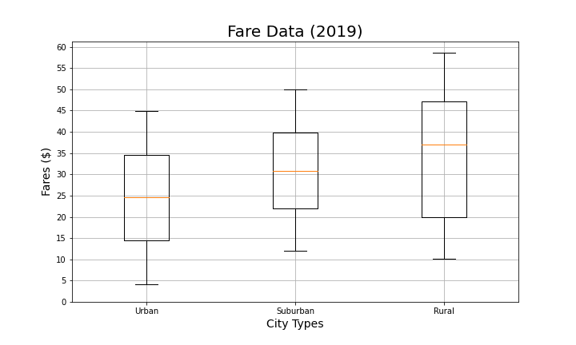

# PyBer Analysis

## Overview
This analysis uses pandas and Matplotlib to visualize data collected about a ride-sharing service called PyBer. By consolidating the data into dataframes and charts, we can observe the differences in number of rides, number of drivers, and average fares between urban, suburban, and rural areas.

## Results

Urban rides accounted for the majority of the dataset, with the largest number of rides and drivers and the largest proportion of the total fares collected.

Rendering these first three columns as pie charts makes the extent to which PyBer's data is dominated by urban ridership very apparent. Urban areas account for the majority of rides and fares, and the vast majority of drivers are located in urban areas.

  

Notably, however, while PyBer collects most of its fares from urban rides because there are so many more of them, suburban and rural rides are significantly more expensive: the average rural fare is more expensive than 75% of urban fares.

## Summary

While one might expect a ride-sharing service to be used most frequently in dense urban areas, the disparities between urban, suburban, and rural areas in this dataset are very large. Suburban areas are underserved, and rural ones even more so.

The price differences betwen urban, suburban, and rural fares are most likely the result of several contributing factors. Urban areas are more dense than suburban ones, which are in turn more dense than rural ones. Average ride distance was not part of this dataset and would have been helpful in reaching more detailed conclusions; howver, given the relative density of the areas, it is very likely that the average rural ride is longer than the average suburban ride, which is again longer than the average urban ride. If the length of a ride plays a part in how the fare for that ride is calculated, reducing the cost per mile for surburban and rural rides would help to make PyBer a more affordable option in those areas.

Ride-sharing fares tend to be significantly impacted by supply and demand, with fares spiking when there are more rides requested than drivers who can accommodate them. This is likely to work against rural riders, where there are very few drivers to begin with. Hiring additional drivers in suburban and rural areas would make rides more available and likely more affordable to potential riders. Alternately, offering incentives to existing drivers to expand the areas they serve could also increase the availability and reduce the price of rides in underserved areas.